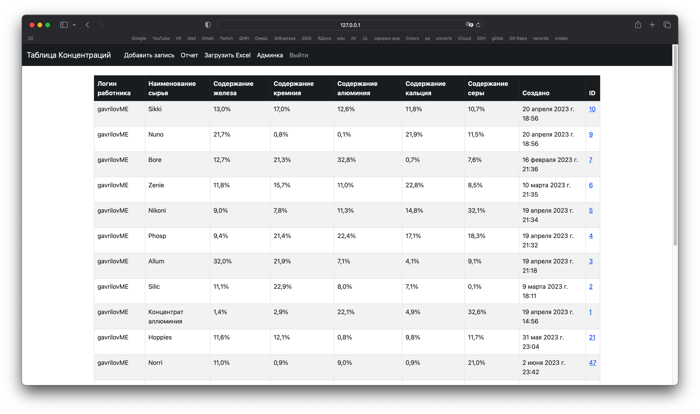
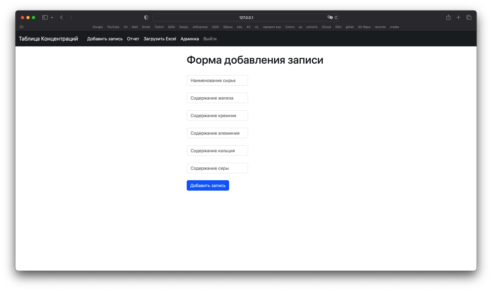
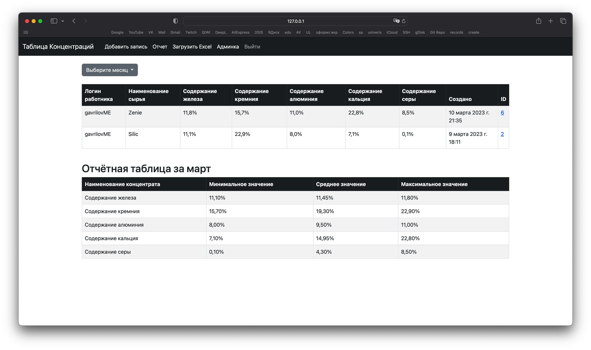
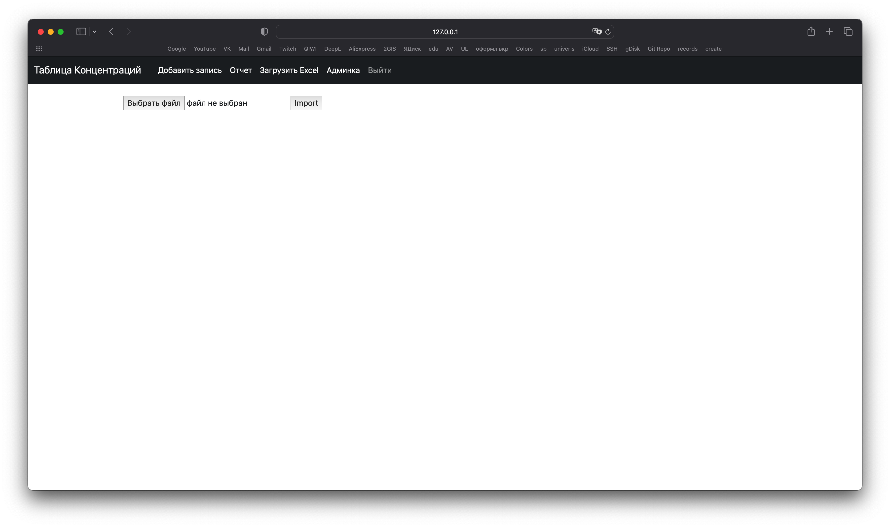

# Ore Concentrates Web Interface

## 🔎 Preview

## 🚀 Features

- Adding raw material composition records
- Month selection switch
- Report Form. Displays average, minimum and maximum values for all concentrates for the selected month
- The data entry form supports insertion from Excel. 
- Authorization Support

## ✅ Usage 

### 📝 Add a record
- Go to the home page, click "Add record" in the header
- Fill out the form with the name of the raw material and the content of each component.
- Click the "Add record" button

### 👀 View reports
- Go to "Report"
- Select the month
- Enjoy the main table and the report table for the selected month

### 📂 Import from Excel
- Click on the Import Excel
- Select a file to download
- You will be redirected to the home page where you can view your added record

